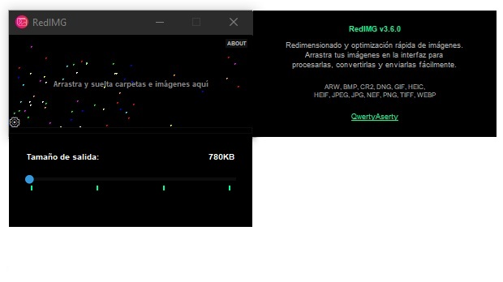

# RedIMG v3.6.0 - Advanced Format Pro 📸✨

[](https://opensource.org/licenses/MIT)


<p align="center">
  
</p>

**RedIMG** es tu herramienta definitiva para la optimización masiva de imágenes con calidad profesional. Es una utilidad de alto rendimiento diseñada para procesar imágenes, reducir su peso, cambiar su formato y mantener la mejor calidad visual posible, ideal para envíos de correo, diseño web y ahorro de almacenamiento.

---

## ✨ Características Principales

### 🚀 Optimización y Rendimiento
- **Turbo Batch**: Procesamiento en paralelo utilizando todos los núcleos de la CPU disponibles para máxima velocidad.
- **Optimización Inteligente**: Búsqueda binaria controlada (6 iteraciones de precisión) y cuantización de color para PNG, garantizando el peso exacto prometido.
- **Gestión de Memoria Activa**: Recolección de basura inteligente integrada para procesar miles de imágenes sin agotar la RAM.

### 📁 Compatibilidad de Formatos
- **Soporte Ampliado**: Procesamiento nativo de **WebP**, **AVIF**, **PNG**, además de **HEIC/HEIF** (iPhone) y fotos **RAW** (.cr2, .nef, .arw, .dng).
- **Conversión Dinámica**: Objetivos de tamaño ajustables (780KB, 1MB, 2MB o sin límite) con escalado automático de resolución.

### 🎨 Interfaz y Experiencia
- **Interfaz High-End**: Tema "Dark Black" asimétrico, controles minimalistas y barra de progreso con estimación de tiempo (ETA).
- **Preservación EXIF**: Rotación y orientación gestionada mediante transposición nativa EXIF.
- **Seguridad RedIMG**: Los originales nunca se sobreescriben; los resultados se guardan en una subcarpeta automática `RedIMG`.

---

## 🛠️ Requisitos del Sistema
- **Python 3.6+**
- **Dependencias**: Listadas en `requirements.txt` (Pillow, CustomTkinter, etc.)

---

## 🚀 Instalación y Uso

1. **Clonar el repositorio**:
   ```bash
   git clone https://github.com/RiderCalcina/RedIMG.git
   cd RedIMG
   ```

2. **Instalar dependencias**:
   ```bash
   pip install -r requirements.txt
   ```

3. **Ejecutar la aplicación**:
   ```bash
   python RedIMG-v3.6.0.py
   ```

---

## 📖 Documentación Detallada

- 📘 [HELP.md](HELP.md) - Manual detallado de funciones y modos de compresión.
- 📜 [CHANGELOG.md](CHANGELOG.md) - Historial de versiones y evolución del proyecto.

---

## 👤 Créditos y Desarrollador

Desarrollado por **QWERTY-ASERTY**
🌐 [Rider Calcina](https://soportetecnico.rf.gd/)

---
*Nota: RedIMG está optimizado para flujos de trabajo rápidos sin comprometer la integridad visual de tus fotografías.*
